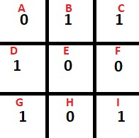

# Linus Food Tips

**Problem Statement:** <br>
In an alternate timeline, Linus Sebastian from Linus Food Tips opened a restaurant. He observed a way by which he could find the happiness of his customers. 

Each table is a square grid of dimension _N_ * _N_ divided into equal cells with dimension 1 * 1. Each square is either empty or filled with a dish. The dishes are placed on the cells randomly. The cells with a dish are denoted by 1 and the ones without a dish are denoted by 0.

He found out that the number of pairs of cells that have a dish that are in the same row or the same column of the square gives the happiness of the customer. Find the happiness of the customer given the grid of dishes.

**Constraints:** <br>
Subtask 1: 30 points
 - 1 &le; _N_ &le; 100

Subtask 2: 50 points
 - 1 &le; _N_ &le; 1000

**Input Format:** <br>
 - The first line contains a single integer _N_
 - The next _N_ lines contain _N_ characters (0 / 1) each denoting the elements of the square

**Output Format:** <br>
 - Print a single integer that is the sum of filled pairs that are in the same row or in the same column of the square

**Sample Input:** <br>
```
3
011
100
101
```

**Sample output:** <br>
```
4
```

**Explanation:** <br><br>


(Cells’ names in red)
 - Pairs of cells on the same row: (_B_, _C_), (_G_, _I_)
 - Pairs of cells on the same column: (_D_, _G_), (_C_, _I_)

Total = 4
